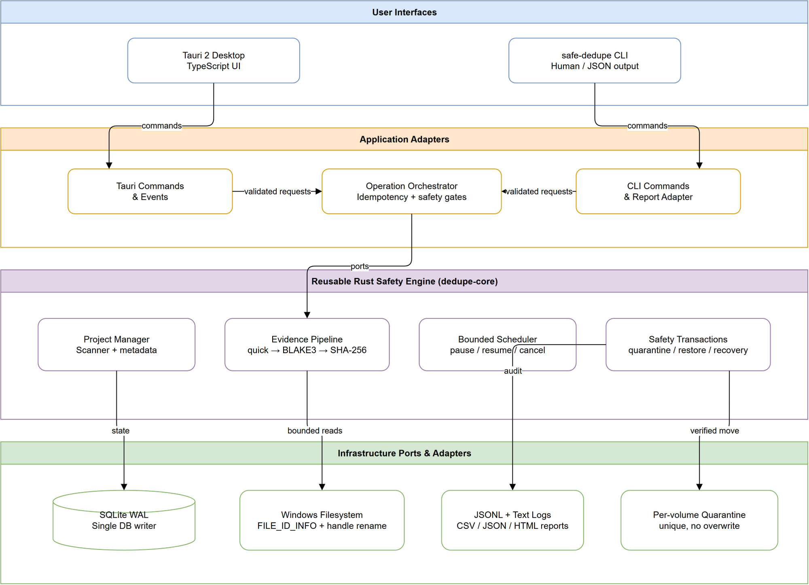

# Trình tìm tệp trùng lặp an toàn

Ứng dụng desktop ưu tiên an toàn để tìm, kiểm chứng, cách ly, khôi phục và xóa các tệp trùng lặp trên
Windows 10/11. Mọi thao tác diễn ra cục bộ; nội dung tệp không được tải lên dịch vụ bên ngoài.

Phiên bản phát hành hiện tại: **0.2.1**.

> [!WARNING]
> Đây là phần mềm có khả năng xóa dữ liệu. Hãy sao lưu dữ liệu quan trọng, xem kỹ tệp giữ lại và thử
> quy trình khôi phục trước khi xóa vĩnh viễn. Bộ cài phát triển hiện chưa được ký Authenticode.



## Điểm nổi bật

- So sánh nghiêm ngặt theo tên chuẩn hóa, kích thước, BLAKE3 đầy đủ và SHA-256 đầy đủ.
- Chỉ tạo nhóm trùng khi tệp ổn định và có thể chứng minh nội dung giống nhau.
- Nhận diện hard link để không coi hai tên của cùng một tệp vật lý là hai bản sao độc lập.
- Quét có thể tạm dừng, tiếp tục, hủy và phục hồi sau khi ứng dụng bị gián đoạn.
- Lập kế hoạch giữ lại theo thư mục ưu tiên, tuổi tệp, đường dẫn hoặc lựa chọn thủ công.
- Chạy thử kế hoạch trước mọi thay đổi dữ liệu.
- Cách ly bằng thao tác đổi tên/di chuyển gắn với handle trong cùng ổ đĩa, không ghi đè.
- Xác minh lại danh tính, kích thước và hai giá trị băm tại đích cách ly.
- Khôi phục không ghi đè và có cơ chế đối soát giao dịch bị gián đoạn.
- Xóa vĩnh viễn chỉ áp dụng cho UUID trong vùng cách ly, có xác nhận ngắn hạn và kiểm tra lại toàn bộ
  tệp trước lần xóa đầu tiên.
- Lịch sử có phân trang cho từng snapshot đã xử lý, nhóm trùng, mọi đường dẫn tương ứng, kế hoạch và
  trạng thái giao dịch/cách ly/xóa.
- Trang bảo trì đo riêng SQLite, WAL, manifest, log và cache giao diện; có thể tối ưu cơ sở dữ liệu
  mà không xóa lịch sử hoặc tệp người dùng.
- Giao diện và thông báo chính bằng tiếng Việt; hỗ trợ báo cáo CSV, JSON và HTML.

## Cách ứng dụng xử lý bản trùng

Ứng dụng không tạo thêm bản copy khi cách ly. Sau khi người dùng khóa kế hoạch:

1. Mỗi nhóm phải có ít nhất một tệp được giữ lại tại thư mục nguồn.
2. Các bản dư thừa đã chọn được **di chuyển** vào thư mục `.safe-duplicate-finder-quarantine` trên
   chính ổ đĩa của chúng.
3. Tệp cách ly được băm lại và chỉ được ghi nhận là `Đã xác minh` khi bằng chứng vẫn khớp.
4. Di chuyển trong cùng ổ đĩa không giải phóng dung lượng. Dung lượng chỉ được thu hồi sau khi người
   dùng chủ động xóa vĩnh viễn các mục cách ly.

Không xóa thủ công thư mục cách ly vì việc đó làm cơ sở dữ liệu và trạng thái tệp mất đồng bộ.

## Quy trình sử dụng

1. Tạo dự án và thêm các thư mục nguồn.
2. Chạy quét chỉ đọc.
3. Xem các nhóm đã chứng minh và chọn tệp cần giữ lại.
4. Khóa kế hoạch, chạy thử và kiểm tra số tệp/dung lượng.
5. Nhập `QUARANTINE` để di chuyển các bản dư thừa vào vùng cách ly.
6. Dùng **Khôi phục** nếu cần hoàn tác.
7. Để thu hồi dung lượng ngay, bật **Xóa ngay**, chọn riêng từng mục hoặc chọn tất cả mục đủ điều
   kiện đang hiển thị, rồi chuẩn bị xác nhận.
8. Dùng **Lịch sử và dọn dẹp** để tra cứu đường dẫn trùng, theo dõi trạng thái xử lý và bảo trì dữ
   liệu cục bộ của ứng dụng.

## Dung lượng mã nguồn và dữ liệu ứng dụng

- `target/` là cache biên dịch Rust, có thể lớn hàng chục GiB sau nhiều lần test/build và đã được
  `.gitignore` loại khỏi Git. Chạy `cargo clean` tại thư mục kho mã để thu hồi phần này; lần build kế
  tiếp sẽ chậm hơn vì phải biên dịch lại. Lưu ý `cargo clean` cũng xóa mọi EXE và checksum trong
  `target/release/`; hãy tải chúng lên GitHub Releases hoặc sao chép ra ngoài kho mã trước khi dọn.
- `apps/desktop/node_modules/` là dependency frontend có thể cài lại bằng `npm ci`.
- Dữ liệu vận hành nằm trong `%LOCALAPPDATA%/io.github.safeduplicate.finder`. Trang **Lịch sử và dọn
  dẹp** chỉ bảo trì phạm vi này; không được phép đi vào thư mục nguồn, vùng cách ly hoặc kho mã.
- **Tối ưu SQLite và dọn WAL** giữ nguyên mọi snapshot/lịch sử. **Xóa log cũ** chỉ xóa log chẩn đoán
  quá hạn. **Dọn cache giao diện** phải được xác nhận riêng và không xóa lịch sử SQLite.

Việc kiểm tra lại nhiều gigabyte có thể mất vài phút. Không đóng ứng dụng khi nút hiển thị
**Đang kiểm tra lại và xóa…**.

## Cài đặt và chạy từ mã nguồn

### Yêu cầu

- Windows 10/11 x86-64.
- WebView2 Runtime.
- Rust stable MSVC theo [rust-toolchain.toml](rust-toolchain.toml) (hiện là 1.97.1).
- Visual Studio 2022 Build Tools với workload C++ Desktop.
- Node.js 24.18.0 LTS và npm 11.

### Chuẩn bị

```powershell
git clone <URL_KHO_GIT_CỦA_BẠN>
cd safe-duplicate-finder
npm --prefix apps/desktop ci
```

### Chạy ứng dụng desktop khi phát triển

Mở Developer PowerShell for Visual Studio hoặc môi trường đã có MSVC, sau đó chạy:

```powershell
npm --prefix apps/desktop run tauri dev
```

Dữ liệu ứng dụng mặc định được lưu tại:

```text
%LOCALAPPDATA%\io.github.safeduplicate.finder\state.db
```

### Dựng bộ cài NSIS

```powershell
.\installer\windows\build-online-installer.ps1
```

Script tạo một EXE tại `target/release/online-installer/`. EXE nhúng helper native nên có thể kiểm tra,
tiếp tục tải và xác minh SHA-256 cho WebView2 trước khi ứng dụng cần WebView2. Tiến độ hiển thị số byte
thực nhận, tổng dung lượng, tốc độ, ETA, tệp hiện tại và tiến độ chung; tệp hoàn chỉnh hợp lệ không bị
tải lại. Thư mục `target/` bị Git bỏ qua; hãy tải EXE lên GitHub Releases thay vì commit vào kho.
Sau khi đã tải lên hoặc sao chép cả EXE lẫn `release-checksums.json` ra ngoài `target/`, có thể chạy
`cargo clean` an toàn mà không ảnh hưởng mã nguồn hay dữ liệu người dùng của ứng dụng.

Cache cài Runtime nằm tại
`%LOCALAPPDATA%\io.github.safeduplicate.finder\installer-cache`. Khi gỡ cài đặt rõ ràng từ shortcut
**Gỡ cài đặt Trình tìm tệp trùng lặp an toàn**, chương trình xóa thư mục cài, dữ liệu/cơ sở dữ liệu/log/
cache cục bộ và shortcut. Các tệp thật trong `.safe-duplicate-finder-quarantine` trên ổ nguồn luôn được
giữ lại để tránh làm mất bản duy nhất còn lại.

## Kiểm thử

Mốc hiện tại đạt **120 kiểm thử Rust** và **15 kiểm thử frontend**.

```powershell
cargo fmt --all -- --check
cargo clippy --workspace --all-targets --all-features -- -D warnings
cargo test --workspace --all-targets --all-features

npm --prefix apps/desktop run lint
npm --prefix apps/desktop run test
npm --prefix apps/desktop run build
npm --prefix apps/desktop run format:check
```

Kiểm tra phụ thuộc tùy chọn trước khi phát hành:

```powershell
cargo deny check -A warnings
cargo audit
npm --prefix apps/desktop audit --audit-level=high
```

Xem [docs/testing.md](docs/testing.md) và [docs/release-evidence.md](docs/release-evidence.md) để biết
phạm vi kiểm thử, các cổng đã đạt và các bước thẩm định bên ngoài còn mở.

## CLI

Biên dịch CLI:

```powershell
cargo build -p safe-dedupe --release
```

Ví dụ quy trình cơ bản:

```powershell
safe-dedupe --database D:\SafeDedupe\state.db project create --name "Sách"
safe-dedupe --database D:\SafeDedupe\state.db project add-root --project <PROJECT_UUID> --path D:\Sach --primary
safe-dedupe --database D:\SafeDedupe\state.db scan start --project <PROJECT_UUID>
safe-dedupe --database D:\SafeDedupe\state.db results list --session <SESSION_UUID>
safe-dedupe --database D:\SafeDedupe\state.db plan create --session <SESSION_UUID> --policy default
safe-dedupe --database D:\SafeDedupe\state.db dry-run --plan <PLAN_UUID>
safe-dedupe --database D:\SafeDedupe\state.db quarantine apply --plan <PLAN_UUID> --confirm QUARANTINE
```

CLI xóa vĩnh viễn vẫn yêu cầu truyền lại token và câu xác nhận do lệnh chuẩn bị trả về:

```powershell
safe-dedupe --database D:\SafeDedupe\state.db quarantine delete-prepare --entry <ENTRY_UUID> --delete-now
safe-dedupe --database D:\SafeDedupe\state.db quarantine delete-execute --batch <BATCH_UUID> --token <TOKEN> --confirm "<EXACT_PHRASE>"
```

Không đặt cơ sở dữ liệu bên trong thư mục nguồn hoặc thư mục cách ly. Mặc định trình quét tập trung vào
PDF, EPUB và MOBI; chỉ bật quét mọi phần mở rộng khi bạn thực sự cần.

## Cấu trúc kho mã

```text
apps/
  cli/                 CLI dùng chung bộ máy Rust
  desktop/             React/TypeScript + Tauri 2
crates/
  dedupe-core/         Mô hình miền, băm, chính sách giữ lại, trạng thái
  dedupe-platform/     Thao tác hệ thống tệp Windows/portable
  dedupe-store/        SQLite, migration, giao dịch, phục hồi
  dedupe-report/       Xuất CSV/JSON/HTML
  dedupe-testkit/      Fixture và tiện ích kiểm thử
benchmarks/            Bộ tạo dữ liệu và trình đo chỉ đọc
docs/                  Kiến trúc, vận hành, bảo mật và bằng chứng
specs/                 Đặc tả, kế hoạch và tác vụ Spec Kit
.specify/              Template, workflow và cấu hình Spec Kit
.agents/skills/        Skill Spec Kit dùng trong tác vụ phát triển
```

## Mô hình an toàn

- Không tự động quét, cách ly hoặc xóa khi khởi động.
- Không xóa trực tiếp đường dẫn nguồn.
- Không theo symlink/junction ra ngoài phạm vi quét.
- Không ghi đè đích cách ly hoặc đích khôi phục.
- Ghi ý định bền vững trước ranh giới thay đổi không thể hoàn tác.
- Chế độ **Xóa ngay** chỉ bỏ qua thời gian giữ; mọi kiểm tra UUID, danh tính, kích thước, BLAKE3,
  SHA-256, token, chế độ và hạn xác nhận vẫn được backend thực thi.
- Không có tự động dọn vùng cách ly.

Xem [docs/threat-model.md](docs/threat-model.md),
[docs/permanent-delete-gate.md](docs/permanent-delete-gate.md) và
[docs/manual-recovery.md](docs/manual-recovery.md).

## Spec Kit và tài liệu thiết kế

Dự án lưu toàn bộ chuỗi đặc tả trong Git:

- [Đặc tả sản phẩm](specs/001-safe-duplicate-removal/spec.md)
- [Kế hoạch triển khai](specs/001-safe-duplicate-removal/plan.md)
- [Mô hình dữ liệu](specs/001-safe-duplicate-removal/data-model.md)
- [Danh sách tác vụ](specs/001-safe-duplicate-removal/tasks.md)
- [Hợp đồng CLI](specs/001-safe-duplicate-removal/contracts/cli.md)
- [Hợp đồng desktop](specs/001-safe-duplicate-removal/contracts/desktop-events.md)

## Đóng góp

1. Tạo nhánh tính năng nhỏ, bám theo đặc tả và bất biến an toàn hiện có.
2. Viết hoặc cập nhật kiểm thử trước khi thay đổi hành vi dữ liệu.
3. Chạy định dạng, Clippy, toàn bộ kiểm thử Rust và frontend.
4. Không commit cơ sở dữ liệu thật, vùng cách ly, log, bộ cài, khóa ký mã hoặc đường dẫn máy cá nhân.
5. Mô tả rõ ảnh hưởng tới dữ liệu và bằng chứng kiểm thử trong pull request.

## Giới hạn hiện tại

- Windows là nền tảng desktop chính; bộ điều hợp portable chủ yếu phục vụ quét/kiểm thử bảo thủ.
- Bộ cài phát triển chưa được ký số.
- Kiểm thử máy sạch, ma trận mất điện/ổ đầy trên thiết bị thật và benchmark 1 TB vẫn là cổng bên ngoài
  trước khi phát hành công khai có chữ ký.
- Kho hiện chưa kèm tệp giấy phép. Chủ sở hữu cần chọn và thêm `LICENSE` trước khi cho phép tái sử dụng
  công khai.
