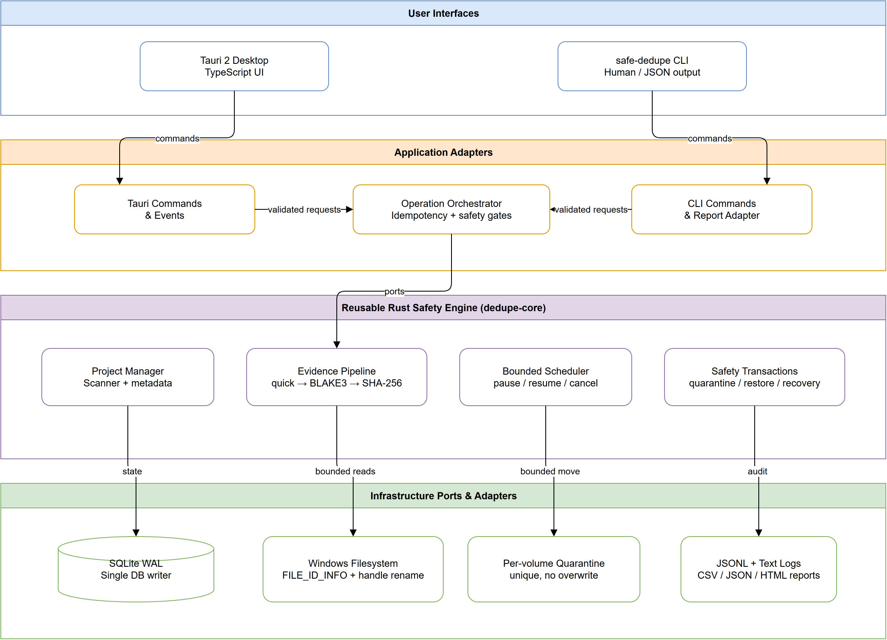
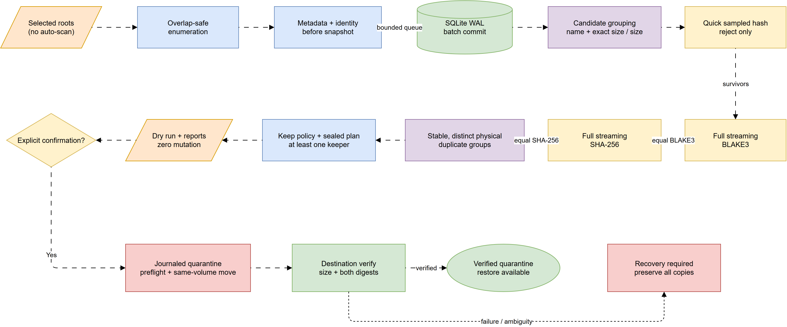
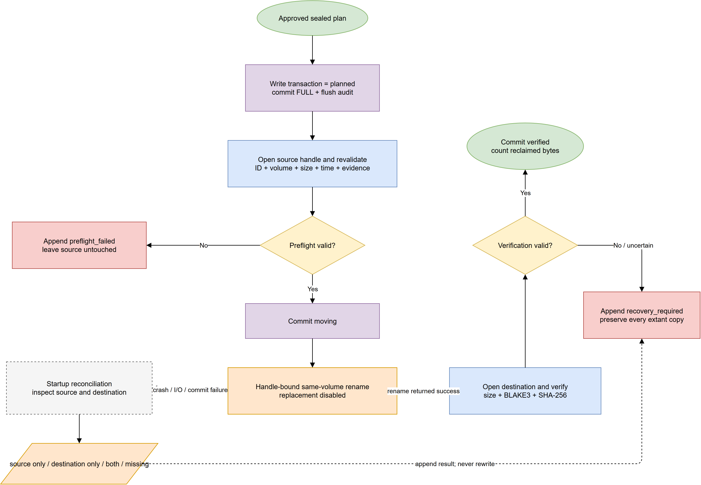
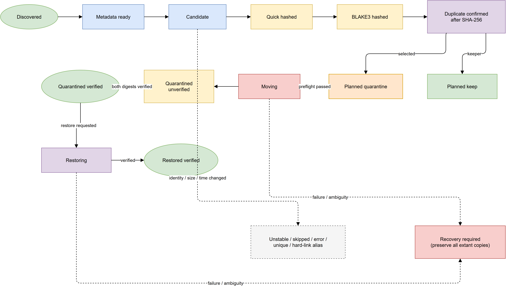

# Kiến trúc

Nguồn chỉnh sửa nằm tại `diagrams/architecture.drawio`. Trình tìm tệp trùng lặp an toàn dùng
workspace Rust kiến trúc lục giác để mọi bộ điều hợp cùng dùng một bộ máy an toàn:

- `dedupe-core`: kiểu miền nghiệp vụ, máy trạng thái, bộ lọc, băm luồng, chính sách giữ tệp, quét,
  cách ly, khôi phục và logic phục hồi.
- `dedupe-store`: schema SQLite WAL, dự án/thư mục gốc, ảnh chụp quét, bằng chứng băm đầy đủ, nhóm, kế
  hoạch khóa, sự kiện giao dịch, manifest JSONL và danh sách cách ly.
- `dedupe-platform`: danh tính vật lý Windows qua `FILE_ID_INFO` và đổi tên cùng ổ đĩa không thay thế.
  Bộ điều hợp portable chỉ đọc/thất bại đóng đối với thao tác thay đổi.
- `dedupe-report`: CSV dạng luồng, JSON và HTML độc lập đã escape.
- `apps/cli` và `apps/desktop`: bộ điều hợp người dùng mỏng trên cùng các crate.

## Luồng dữ liệu

Quá trình liệt kê truyền ảnh chụp vào các giao dịch SQLite ngắn. Nhóm ứng viên được đọc lại theo
`(normalized_name, size)` ở chế độ nghiêm ngặt hoặc theo `size` trong chế độ nội dung đã xác nhận. Mẫu
băm nhanh chỉ dùng để loại trừ. BLAKE3 đầy đủ chia nhóm các tệp còn lại; SHA-256 đầy đủ cung cấp giá
trị băm độc lập thứ hai. Siêu dữ liệu được chụp trước và sau mỗi lần đọc; kết quả không ổn định không
bao giờ trở thành thành viên.

Hiện tại, các nhóm ứng viên đi tuần tự qua ranh giới bộ lập lịch bảo thủ. Cách này hạn chế truy cập
ngẫu nhiên và bộ nhớ, trong khi token điều khiển cho phép tạm dừng/tiếp tục/hủy giữa các tệp và mỗi
khối băm 1 MiB.

## Ranh giới thay đổi dữ liệu

Chỉ `dedupe-core::transaction_journal::execute_verified_move` được thực thi di chuyển cách ly/khôi
phục. Thứ tự:

1. Ghi nối và fsync sự kiện manifest JSONL `planned`, sau đó commit trạng thái SQLite và bản ghi kiểm
   toán tương ứng trong một giao dịch `synchronous=FULL`.
2. Mở nguồn mà không đi theo reparse point; kiểm tra lại danh tính vật lý, kích thước chính xác và
   token ảnh chụp từ handle đó.
3. Lưu `preflight_validated`, rồi `moving`.
4. Đổi tên handle đã xác minh trên cùng ổ đĩa bằng `SetFileInformationByHandle`; tắt thay thế nên
   không bao giờ ghi đè đích đã tồn tại.
5. Lưu `moved_unverified`.
6. Mở lại đích, xác minh danh tính vật lý, kích thước, BLAKE3 đầy đủ và SHA-256 đầy đủ.
7. Lưu `verified`; chỉ lúc đó mới tạo/cập nhật danh sách cách ly và tính số byte.

SQLite dùng WAL, khóa ngoại, `synchronous=FULL`, thời gian chờ bận 5 giây, bảng strict và trigger chỉ
ghi nối cho lịch sử giao dịch/kiểm toán. Một mutex tuần tự hóa mọi bộ ghi; ảnh chụp đọc dùng kết nối chỉ
đọc riêng. Thứ tự manifest-trước-cơ-sở-dữ-liệu thất bại đóng: fsync manifest thất bại sẽ ngăn chuyển
trạng thái và thay đổi hệ thống tệp; lỗi cơ sở dữ liệu sau đó có thể để lại một bản ghi manifest dư
phục vụ phân tích phục hồi, không bao giờ để lại thao tác di chuyển không có nhật ký.

## Máy trạng thái

Miền nghiệp vụ từ chối chuyển trạng thái bất hợp lệ; cập nhật compare-and-set trong nhật ký kiểm tra
lại lần nữa. Lỗi mơ hồ sau di chuyển kết thúc ở `recovery_required`; không đoạn mã nào xem việc hàm
đổi tên trả về thành công là đủ để chứng minh hoàn tất.

## Tính cục bộ và riêng tư

Bộ máy không có trình khách mạng. Nội dung tài liệu được đọc qua bộ đệm có giới hạn và không bao giờ
ghi vào nhật ký/cơ sở dữ liệu. Nhật ký chỉ chứa siêu dữ liệu thao tác và đường dẫn. Cơ sở dữ liệu
desktop cùng nhật ký JSONL/văn bản hằng ngày nằm trong thư mục dữ liệu cục bộ của ứng dụng; dữ liệu
CLI nằm cạnh đường dẫn cơ sở dữ liệu được chỉ định rõ ràng.
